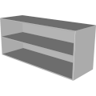

# 3D Assets


## Bookshelf

This generator creates a 3D bookshelf. A set of
parameters control the size and the shape of the bookshelf. It is possible to generale low-poly bookshelf by reducing
the complexity, removing roundness and using flat shading. Click
on a snapshot to open it online.

<p class="gallery">

	<a class="style-block nocaption" href="../online/bookshelf.html?width=90&depth=20&thickness=2&offset=10&roundness=2&shelfHeight=25&shelvesCount=3&roundDetail=1&flat=false&simple=false">
		
	</a>

	<a class="style-block nocaption" href="../online/bookshelf.html?width=51.3&depth=20&thickness=2&offset=10&roundness=2&shelfHeight=25&shelvesCount=5&roundDetail=1&flat=false&simple=false">
		
	</a>

	<a class="style-block nocaption" href="../online/bookshelf.html?width=120&depth=40&thickness=1.3&offset=0&roundness=2&shelfHeight=25&shelvesCount=2&roundDetail=1&flat=false&simple=false">
		
	</a>

</p>


### Code example

```js
import { Bookshelf } from "3d-assets/bookshelf.js";

var model = new Bookshelf ({
	width:         90,
	depth:         20,
	thickness:      2,
	legs:        10,
	roundness:      2,
	shelfHeight:   25,
	shelvesCount:   3,

	roundDetail:    1,
	flat:	    false,
	simple:     false,
});
```


### Parameters

#### General Parameters

* `width` &ndash; width of the bookshelf, in cm, [30, 120]
* `depth` &ndash; depth of the bookshelf, in cm, [10, 40]
* `thickness` &ndash; thickness of the bookshelf's parts, in cm, [1, 3]
* `legs` &ndash; offset of the first shelf from the ground, in cm, [0, 30]
* `roundness` &ndash; radius of the beveled edges, in mm, [0, 20]

#### Shelves Parameters

* `shelfHeight` &ndash; height of each shelf, in cm, [10, 50]
* `shelvesCount` &ndash; number of shelves on the bookshelf, [1, 10]

#### Complexity Parameters

* `roundDetail` &ndash; detail of the beveled edges, [1, 4]
* `simple` &ndash; if *true* the complexity of the profile is reduced, boolean
* `flat` &ndash; if *true* flat shading is used, boolean

### Internal structure

An instance of `Bookshelf` is a `THREE.Group` with one submesh
called `body`.


### Minimal example

[demos/minimal-bookshelf.html](../demos/minimal-bookshelf.html)


### Online generator

[online/bookshelf.html](../online/bookshelf.html)


### Source

[src/bookshelf.js](https://github.com/boytchev/assets/blob/main/src/bookshelf.js)

		
<div class="footnote">
	<a href="../">Home</a>
</div>
