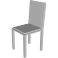
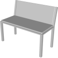

# 3D Assets


## Chair

This generator creates a 3D chair. A set of
parameters control the size and the shape of the chair. It is possible to generale low-poly chair by reducing
the complexity, removing roundness and using flat shading. Click
on a snapshot to open it online.

<p class="gallery">

	<a class="style-block nocaption" href="../online/chair?seatWidth=42&seatDepth=45&seatHeight=45&seatThickness=2&legThickness=4&cussionThickness=3&cussionOffset=2&backrestHeight=50&backrestSidesThickness=4&backrestAngle=5&cussionRoundness=0.2&cussionDetail=2&flat=false&simple=false">
		
	</a>

	<a class="style-block nocaption" href="../online/chair?seatWidth=100&seatDepth=45&seatHeight=45&seatThickness=2&legThickness=4&cussionThickness=3&cussionOffset=2&backrestHeight=36.35&backrestSidesThickness=4&backrestAngle=11.7&cussionRoundness=0.02&cussionDetail=2&flat=false&simple=false">
		
	</a>

	<a class="style-block nocaption" href="../online/chair?seatWidth=42&seatDepth=100&seatHeight=20&seatThickness=2&legThickness=4&cussionThickness=3&cussionOffset=2&backrestHeight=50&backrestSidesThickness=4&backrestAngle=45&cussionRoundness=0.02&cussionDetail=1&flat=true&simple=false">
		
	</a>

</p>


### Code example

```js
import { Chair } from "3d-assets/chair.js";

var model = new Chair ({
	seatWidth: 42,
	seatDepth: 45,
	seatHeight: 45,
	seatThickness: 2,
	legThickness: 4,
	cussionThickness: 3,
	cussionOffset: 2,
	backrestHeight: 50,
	backrestSidesThickness: 4,
	backrestAngle: 5,

	cussionRoundness: 0.2,
	cussionDetail: 2,

	flat: false,
	simple: false,
});
```


### Parameters

#### Seat parameters

* `seatWidth` &ndash; width of the seat in cm, [ 20, 100 ],
* `seatDepth` &ndash; depth of the seat in cm, [ 20, 100 ],
* `seatHeight` &ndash; height of the seat in cm, [ 20, 100 ],
* `seatThickness` &ndash; thickness of seat in cm, [ 2, 10 ],

#### Backrest parameters

* `backrestHeight` &ndash; height of the backrest in cm, [ 10, 100 ],
* `backrestSidesThickness` &ndash; thickness of the backside supports in cm, [ 1, 10 ],
* `backrestAngle` &ndash; tilt of the backrest in degrees, [ 0, 45 ],

#### Cussions parameters

* `cussionThickness` &ndash; thickness of the cussions in cm, [ 2, 15 ],
* `cussionOffset` &ndash; offset of the cussion to the end of the seat frame in cm, [ 2, 5 ],
* `cussionRoundness` &ndash; roundness of the cussions relative to their size, [ 0, 0.2 ],
* `upholstery` &ndash; if *true* the pillows are replaced with upholstery on the chair and `cussionThickness` has no effect, boolean

#### Legs parameters

* `legThickness` &ndash; thickness of the chair's legs in cm, [ 2, 10 ],

#### Complexity parameters

* `cussionDetail` &ndash; number of faces across the rounded part of the cussions, [ 1, 10 ],
* `simple` &ndash; if *true* the complexity of the cussions is reduced, boolean
* `flat` &ndash; if *true* flat shading is used, boolean
	
### Internal structure

An instance of `Chair` is a `THREE.Group` with two submeshes
called `frame` and `cussions`. 


### Minimal example

[demos/minimal-mug.html](../demos/minimal-chair.html)


### Online generator

[online/mug.html](../online/chair.html)


### Source

[src/mug.js](https://github.com/boytchev/assets/blob/main/src/chair.js)

		
<div class="footnote">
	<a href="../">Home</a>
</div>
