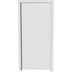
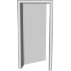
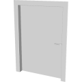

# 3D Assets


## Doorframe

This generator creates a 3D doorframe. A set of
parameters control the size and the shape of the doorframe. It is possible to generale low-poly doorframe by reducing
the complexity, removing roundness and using flat shading. Click
on a snapshot to open it online.

<p class="gallery">

	<a class="style-block nocaption" href="../online/doorframe?width=90&height=210&thickness=2&openness=0&roundness=1&frameThickness=7&wallThickness=15&roundDetail=1&hingeDetail=8&flat=false&simple=false">
		
	</a>

	<a class="style-block nocaption" href="../online/doorframe?width=90&height=210&thickness=5&openness=0.48&roundness=5&frameThickness=10&wallThickness=30&roundDetail=1&hingeDetail=5&flat=false&simple=false">
		
	</a>

	<a class="style-block nocaption" href="../online/doorframe?width=100&height=150&thickness=0.4&openness=0&roundness=1&frameThickness=10&wallThickness=10&roundDetail=1&hingeDetail=8&flat=false&simple=false">
		
	</a>

</p>


### Code example

```js
import { Doorframe } from "3d-assets/doorframe.js";

var model = new Doorframe ({
	width:          90,
	height:        210,
	thickness:       2,
	openness:        0,
	roundness:       1,
	frameThickness:  7,
	wallThickness:  15,


	roundDetail:    1,
	hingeDetail:    8,
	flat:	    false,
	simple:     false,
});
```


### Parameters

#### General Parameters

* `width` &ndash; width of the door, in cm, [50, 100]
* `height` &ndash; height of the door, in cm, [150, 300]
* `thickness` &ndash; thickness of the door, in cm, [.4, 5]
* `openness` &ndash; how much is the door open, in percent, [0, 1]
* `roundness` &ndash; radius of the bevel, in cm, [0, 5]
* `frameThickness` &ndash; thickness of the frame, in cm, [3, 10]
* `wallThickness` &ndash; thickness of the wall through which the door goes, in cm, [10, 30]

#### Complexity Parameters

* `roundDetail` &ndash; detail of the beveled edges, [1, 4]
* `hingeDetail` &ndash; detail of the cylinder that acts as a hinge, [5, 30]
* `simple` &ndash; if *true* the complexity of the profile is reduced, boolean
* `flat` &ndash; if *true* flat shading is used, boolean

### Internal structure

An instance of `Doorframe` is a `THREE.Group` with one submesh
called `body` and another sumbesh called `door`.


### Minimal example

[demos/minimal-doorframe.html](../demos/minimal-doorframe.html)


### Online generator

[online/doorframe.html](../online/doorframe.html)


### Source

[src/doorframe.js](https://github.com/boytchev/assets/blob/main/src/doorframe.js)

		
<div class="footnote">
	<a href="../">Home</a>
</div>
