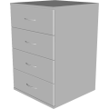
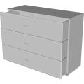
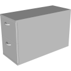

# 3D Assets


## Drawer

This generator creates a 3D drawer with a handle. A set of
parameters control the size and the shape of the drawer and its
handle. It is possible to generale low-poly drawer by reducing
the complexity, removing edges and using flat shading. Click
on a snapshot to open it online.

<p class="gallery">

	<a class="style-block nocaption" href="../online/drawer?width=40&height=60&thickness=1.5&depth=40&drawerCount=4&doorRoundness=0.02&openness=0&handleThickness=0.5&handleSize=10&handleHeight=0.5&handleRoundDetail=1&doorRoundDetail=1&flat=false&simple=false">
		
	</a>

	<a class="style-block nocaption" href="../online/drawer?width=80&height=60&thickness=1.5&depth=30&drawerCount=3&doorRoundness=0.02&openness=0.43&handleThickness=0.5&handleSize=10&handleHeight=0.5&handleRoundDetail=1&doorRoundDetail=1&flat=true&simple=false">
		
	</a>

	<a class="style-block nocaption" href="../online/drawer?width=20&height=30&thickness=1.3&depth=48.4&drawerCount=2&doorRoundness=0.02&openness=0&handleThickness=1&handleSize=5&handleHeight=0.78&handleRoundDetail=1&doorRoundDetail=1&flat=false&simple=false">
		
	</a>

</p>


### Code example

```js
import { Drawer } from "3d-assets/drawer.js";

var model = new Drawer ({
	width: 40,
	height: 60,
	thickness: 1.5,
	depth: 40,
	drawerCount: 4,
                             
	doorRoundness: .02,
	openness: 0,
                             
	handleThickness: 0.5,
	handleSize: 10,
	handleHeight: 0.5,
                             
	handleRoundDetail: 1,
	doorRoundDetail: 1,
	flat: false,
	simple: false,
});
```


### Parameters

	
### Internal structure

An instance of `Drawer` is a `THREE.Group` with one submesh
called `body` and `drawerCount` submeshes `drawer_<i>` for each drawer in it. 


### Minimal example

[demos/minimal-drawer.html](../demos/minimal-drawer.html)


### Online generator

[online/drawer.html](../online/drawer.html)


### Source

[src/drawer.js](https://github.com/boytchev/assets/blob/main/src/drawer.js)

		
<div class="footnote">
	<a href="../">Home</a>
</div>
