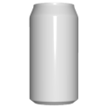
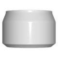
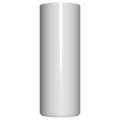

# 3D Assets


## Drink can

This generator creates a 3D drink can . A set of parameters
control the size and the shape of the can. It is possible to
generale low-poly drink-can by reducing the complexity,
removing edges and using flat shading. Click on a snapshot
to open it online.

<p class="gallery">

	<a class="style-block nocaption" href="../online/drink-can.html?canHeight=12&canSize=6&canComplexity=70&neckHeight=1.5&neckSize=5&neckLid=true&neckTag=true&edges=true&flat=false">
		
	</a>

	<a class="style-block nocaption" href="../online/drink-can.html?canHeight=5&canSize=7.46&canComplexity=70&neckHeight=1.5&neckSize=6.5&neckLid=true&neckTag=true&edges=true&flat=false">
		
	</a>

	<a class="style-block nocaption" href="../online/drink-can.html?canHeight=13.4&canSize=5&canComplexity=70&neckHeight=1.5&neckSize=5.9&neckLid=true&neckTag=true&edges=true&flat=false">
		
	</a>

</p>


### Code example

```js
import { DrinkCan } from "3d-assets/drink-can.js";

var model = new DrinkCan ({
	canHeight: 12,
	canSize: 6,
	canComplexity: 70,
	neckHeight: 1.5,
	neckSize: 5,
	neckLid: true,
	neckTag: true,
	edges: true,
	flat: false
});
```


### Parameters

#### Can parameters

* `canHeight` &ndash; height of the drink can, in cm, [5, 20]
* `canSize` &ndash; diameter of the drink-can, in cm, [5, 8]
	
#### Neck parameters

* `neckHeight` &ndash; desired height of the neck, in cm, [1, 3]
* `neckSize` &ndash; desired size of the neck, in cm, [4, 9]
* `neckLid` &ndash; if *true* the lid is textured, if *false* the lid is flat, boolean
* `neckTag` &ndash; if *true* the lid has a tag, if *false* the lid has no tag, boolean

#### Complexity parameters

* `canComplexity` &ndash; number of faces along the drink can perimeter, as percentage, [0, 100]
* `edges` &ndash; if *true* edges are rounded, if *false* edges are sharp, boolean
* `flat` &ndash; if *true* flat shading is used, if *false* smooth shading is used, boolean
	
	
### Online generator

[online/drink-can.html](../online/drink-can.html)


### Source

[src/drink-can.js](https://github.com/boytchev/assets/blob/main/src/drink-can.js)

		
<div class="footnote">
	<a href="../">Home</a>
</div>