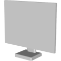

# 3D Assets


## Monitor

This generator creates a 3D monitor. A set of
parameters control the size and the shape of the monitor. It is possible to generale low-poly monitor by reducing
the complexity, removing roundness and using flat shading. Click
on a snapshot to open it online.

<p class="gallery">

	<a class="style-block nocaption" href="../online/monitor?aspectX=16&aspectY=9&diagonal=24&screenThickness=1.5&baseHeight=7&baseThickness=2&baseWidth=20&baseDepth=15&handleWidth=4&bevelDetail=2&flat=false&simple=false">
		
	</a>

	<a class="style-block nocaption" href="http://localhost/online/monitor?aspectX=4&aspectY=3&diagonal=20&screenThickness=1.5&baseHeight=5.1&baseThickness=2.2&baseWidth=13.9&baseDepth=12.5&handleWidth=7&bevelDetail=2&flat=false&simple=false">
		
	</a>

	<a class="style-block nocaption" href="http://localhost/online/monitor?aspectX=21&aspectY=9&diagonal=34&screenThickness=0.7&baseHeight=7&baseThickness=2&baseWidth=30&baseDepth=10.3&handleWidth=4&bevelDetail=2&flat=false&simple=false">
		
	</a>

</p>


### Code example

```js
import { Monitor } from "3d-assets/monitor.js";

var model = new Monitor ({
	aspectX: 16   
	aspectY: 9    
	diagonal: 24   
	screenThickness: 1.5
	baseHeight: 7
	baseThickness: 2
	baseWidth: 20
	baseDepth: 15
	handleWidth: 4

	bevelDetail: 2
	flat: false
	simple: false
});
```


### Parameters

#### Screen parameters

* `aspectX` &ndash; numerator of the aspect ratio, [1, 40]
* `aspectY` &ndash; denominator of the aspect ratio, [1, 40]
* `diagonal` &ndash; diagonal of the display in inches, [5, 40]
* `screenThickness` &ndash; thickness of the screen in cm, [0.2, 4]

#### Base parameters

* `baseHeight` &ndash; distance from the ground to the bottom-most part of the screen in cm, [0, 20]
* `baseThickness` &ndash; thikcness of the base plate in cm, [.5, 3]
* `baseWidth` &ndash; width of the base plate in cm, [10, 30]
* `baseDepth` &ndash; depth of the base plate in cm, [10, 30]
* `handleWidth` &ndash; width of the handle of the monitor in cm, [3, 10]

#### Complexity parameters

* `bevelDetail` &ndash; number of edges across the bevels on the model, [1, 6]
* `simple` &ndash; if *true* the complexity of the profile is reduced, boolean
* `flat` &ndash; if *true* flat shading is used, boolean


### Internal structure

An instance of `Monitor` is a `THREE.Group` with two submeshes
called `body` and `screen`. The `screen` mesh can be used to display an image on the monitor's display.


### Minimal example

[demos/minimal-monitor.html](../demos/minimal-monitor.html)


### Online generator

[online/monitor.html](../online/monitor.html)


### Source

[src/monitor.js](https://github.com/boytchev/assets/blob/main/src/monitor.js)

		
<div class="footnote">
	<a href="../">Home</a>
</div>
