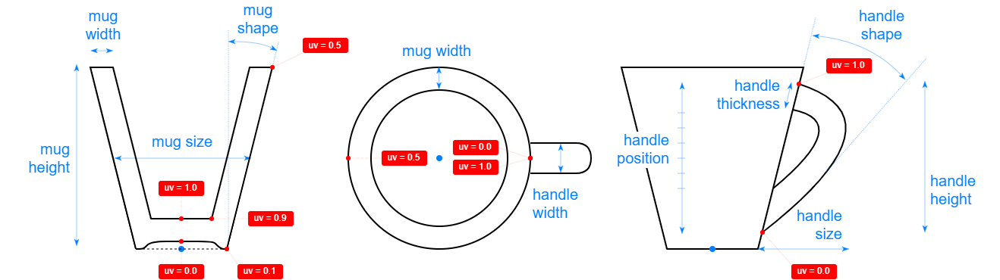

# 3D Assets


## Mug

This generator creates a 3D mug with a handle. A set of
parameters control the size and the shape of the mug and its
handle. It is possible to generale low-poly mug by reducing
the complexity, removing edges and using flat shading. Click
on a snapshot to open it online.

<p class="gallery">

	<a class="style-block nocaption" href="../online/mug.html?mugHeight=10&mugSize=8&mugShape=0&mugWidth=0.4&handlePosition=20&handleHeight=6&handleSize=7&handleShape=20&handleWidth=1.5&handleThickness=0.6&mugComplexity=50&handleComplexity=30&simple=false&flat=false">
		
	</a>

	<a class="style-block nocaption" href="../online/mug.html?mugHeight=9.86&mugSize=8.46&mugShape=-13.5&mugWidth=0.699&handlePosition=56&handleHeight=6.9&handleSize=5.66&handleShape=40&handleWidth=1.04&handleThickness=0.76&mugComplexity=80&handleComplexity=40&simple=false&flat=false">
		
	</a>

	<a class="style-block nocaption" href="../online/mug.html?mugHeight=10.12&mugSize=6.37&mugShape=9.4&mugWidth=0.3&handlePosition=-100&handleHeight=4.8&handleSize=5.17&handleShape=-40&handleWidth=1.15&handleThickness=0.91&mugComplexity=10&handleComplexity=4&simple=true&flat=true">
		
	</a>

</p>


### Code example

```js
import { Mug } from "3d-assets/mug.js";

var model = new Mug ({
	mugHeight: 19.8,
	mugSize: 8.64,
	mugShape: 3.2,
	mugWidth: 0.329,
	mugComplexity: 50,
	handlePosition: 95,
	handleHeight: 7.3,
	handleSize: 6.07,
	handleShape: -34.9,
	handleWidth: 1.42,
	handleThickness: 0.74,
	handleComplexity: 30,
	simple: false,
	flat: false
});
```


### Parameters

#### Mug parameters

* `mugHeight` &ndash; height of the mug, in cm, [7, 20]
* `mugSize` &ndash; diameter of the mug, in cm, [6, 12]
* `mugShape` &ndash; slope of the walls, in degrees, [-15, 15]
* `mugWidth` &ndash; width of the walls, in cm, [0.3, 1]
	
#### Handle parameters

* `handlePosition` &ndash; vertical position of the handle, as percentage, [-100, 100]
* `handleHeight` &ndash; desired height of the handle, in cm, [3, 18]
* `handleSize` &ndash; desired extension size of the handle, in cm, [3, 10]
* `handleShape` &ndash; slope of handle control points, in degrees, [-80, 80]
* `handleWidth` &ndash; width of the handle cross-section, in cm, [1, 2]
* `handleThickness` &ndash; thickness of the handle cross-section, in cm, [0.3, 1]

#### Complexity parameters

* `mugComplexity` &ndash; number of faces along the mug perimeter, [4, 120]
* `handleComplexity` &ndash; number of faces along the handle, [3, 80]
* `simple` &ndash; if *true* the complexity of the profile is reduced, boolean
* `flat` &ndash; if *true* flat shading is used, boolean
	
	
### Internal structure

An instance of `Mug` is a `THREE.Group` with two submeshes
called `body` and `handle`. 




### Minimal example

[demos/minimal-mug.html](../demos/minimal-mug.html)


### Online generator

[online/mug.html](../online/mug.html)


### Source

[src/mug.js](https://github.com/boytchev/assets/blob/main/src/mug.js)

		
<div class="footnote">
	<a href="../">Home</a>
</div>