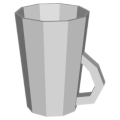

# 3D Assets


## Mug

This generator creates a 3D mug with a handle. A set of
parameters control the size and the shape of the mug. Click
on a snapshot to open it online.

<p class="gallery">

	<a class="style-block nocaption" href="../online/mug.html?mugHeight=19.91&mugSize=9.28&mugShape=-0.6&mugWidth=0.999&handlePosition=75&handleHeight=17.82&handleSize=9.14&handleShape=-17.3&handleWidth=1.84&handleThickness=0.36&complexity=63.02&complexityHandle=23.16">
		
	</a>

	<a class="style-block nocaption" href="../online/mug.html?mugHeight=9.86&mugSize=8.46&mugShape=-13.5&mugWidth=0.699&handlePosition=56&handleHeight=6.9&handleSize=5.66&handleShape=40&handleWidth=1.04&handleThickness=0.76&complexity=89.79&complexityHandle=53.03">
		
	</a>

	<a class="style-block nocaption" href="../online/mug.html?mugHeight=14.54&mugSize=9.48&mugShape=15&mugWidth=0.699&handlePosition=-100&handleHeight=6.9&handleSize=5.66&handleShape=-16.8&handleWidth=2&handleThickness=0.76&complexity=100&complexityHandle=53.03">
		
	</a>

</p>


### Code example

TO DO

<!--
```js
import { concrete } from "tsl-textures/concrete.js";

model.material.normalNode = concrete ( {
	scale: 2,
	density: 0.5,
	bump: 0.5,
	seed: 0
} );
```
-->


### Parameters

TO DO

<!--
* `scale` &ndash; level of details of the pattern, higher value generates finer details, [0, 4]
* `density` &ndash; pattern density [0,1]
* `bump` &ndash; bumpiness (height) of grains, negative bumps make dents [-2,2]
* `seed` &ndash; number for the random generator, each value generates specific pattern
-->

### Online generator

[online/mug.html](../online/mug.html)

### Source

[src/mug.js](https://github.com/boytchev/assets/blob/main/src/mug.js)

		
<div class="footnote">
	<a href="../">Home</a>
</div>