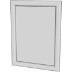
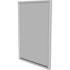
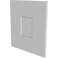
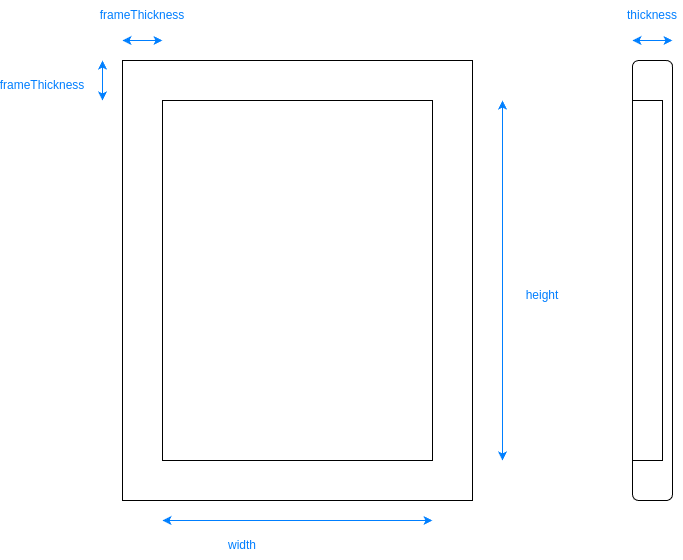

# 3D Assets


## Photo Frame

This generator creates a 3D photo frame. A set
of parameters control the size and the shape of the photo frame.
It is possible to generale low-poly photo frame by reducing its
complexity, removing edges and using flat shading. Click
on a snapshot to open it online.

<p class="gallery">

	<a class="style-block nocaption" href="../online/photo-frame?width=21&height=29.7&thickness=1&roundness=1&frameThickness=3&roundDetail=1&flat=false&simple=false">
		
	</a>

	<a class="style-block nocaption" href="../online/photo-frame?width=50.5&height=76.2&thickness=3&roundness=0.5&frameThickness=2.3&roundDetail=1&flat=false&simple=false">
		
	</a>

	<a class="style-block nocaption" href="../online/photo-frame?width=12.6&height=17.7&thickness=0.8&roundness=1.5&frameThickness=15&roundDetail=2&flat=false&simple=false">
		
	</a>

</p>


### Code example

```js
import { PhotoFrame } from "3d-assets/photo-frame.js";

var model = new PhotoFrame ({
	width: 21.0,
	height: 29.7,
	thickness: 1,
	roundness: 1,
	frameThickness: 3,
	roundDetail: 1,
	flat: false,
	simple: false,
});
```

### Parameters

#### General Parameters

* `width` &ndash; width of the inside of the frame, in cm, [10, 100]
* `height` &ndash; height of the inside of the frame, in cm, [10, 300]
* `thickness` &ndash; thickness of the frame, in cm, [.4, 3]
* `roundness` &ndash; bevel radius of the frame, in cm, [0, 3]
* `frameThickness` &ndash; width of the frame, in cm, [1, 15]

#### Complexity Parameters

* `roundDetail` &ndash; detail of the bevels of the frame, [1, 10]
* `simple` &ndash; if *true* the complexity of the profile is reduced, boolean
* `flat` &ndash; if *true* flat shading is used, boolean
	
### Internal structure

An instance of `PhotoFrame` is a `THREE.Group` with two submeshes called `body` and `plane`. 
The second can be used to display a photograph in the frame.




### Minimal example

[demos/minimal-photo-frame.html](../demos/minimal-photo-frame.html)


### Online generator

[online/photo-frame.html](../online/photo-frame.html)


### Source

[src/photo-frame.js](https://github.com/boytchev/assets/blob/main/src/photo-frame.js)

		
<div class="footnote">
	<a href="../">Home</a>
</div>
