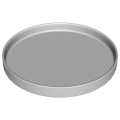
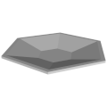
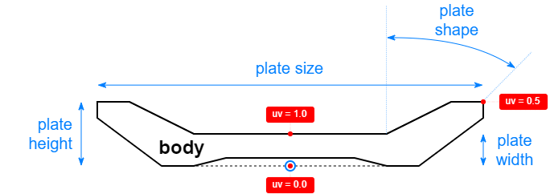

# 3D Assets


## Plate

This generator creates a 3D traditional or flat plate. A set
of parameters control the size and the shape of the plate.
It is possible to generale low-poly plate by reducing its
complexity, removing edges and using flat shading. Click
on a snapshot to open it online.

<p class="gallery">

	<a class="style-block nocaption" href="../online/plate.html?plateHeight=1.6&plateSize=18&plateShape=25&plateWidth=0.3&plateComplexity=70&simple=false&flat=false">
		
	</a>

	<a class="style-block nocaption" href="../online/plate.html?plateHeight=1.94&plateSize=18&plateShape=0&plateWidth=0.384&plateComplexity=99&simple=false&flat=false">
		
	</a>

	<a class="style-block nocaption" href="../online/plate.html?plateHeight=2.8&plateSize=24.72&plateShape=35&plateWidth=1&plateComplexity=6&simple=true&flat=true">
		
	</a>

</p>


### Code example

```js
import { Plate } from "3d-assets/plate.js";

var model = new Plate ({
	plateHeight: 1.6,
	plateSize: 18,
	plateShape: 25,
	plateWidth: 0.3,
	plateComplexity: 50,
	simple: false,
	flat: false
});
```


### Parameters

#### Plate parameters

* `plateHeight` &ndash; height of the plate, in cm, [0.5, 5]
* `plateSize` &ndash; diameter of the plate, in cm, [6, 30]
* `plateShape` &ndash; slope of the walls, in degrees, [0, 35]
* `plateWidth` &ndash; width of the walls, in cm, [0.3, 1]

#### Complexity parameters

* `plateComplexity` &ndash; number of faces along the plate perimeter, [4, 120]
* `simple` &ndash; if *true* the complexity of the profile is reduced, boolean
* `flat` &ndash; if *true* flat shading is used, boolean
	
	
### Internal structure

An instance of `Plate` is a `THREE.Group` with one submesh called `body`. 




### Minimal example

[demos/minimal-plate.html](../demos/minimal-plate.html)


### Online generator

[online/plate.html](../online/plate.html)


### Source

[src/plate.js](https://github.com/boytchev/assets/blob/main/src/plate.js)

		
<div class="footnote">
	<a href="../">Home</a>
</div>