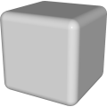
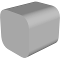
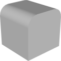
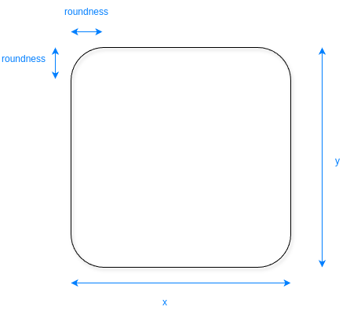

# 3D Assets


## Round Box

This generator creates a rounded box. It is used as a building block of most of the other models. Click
on a snapshot to open it online.

<p class="gallery">

	<a class="style-block nocaption" href="../online/round-box.html?x=1&y=1&z=1&f0=true&f1=true&f2=true&f3=true&f4=true&f5=true&r0=true&r1=true&r2=true&r3=true&r4=true&r5=true&c0=true&c1=true&c2=true&c3=true&c4=true&c5=true&roundness=0.2&roundDetail=3&flat=false&simple=false">
		
	</a>

	<a class="style-block nocaption" href="../online/round-box.html?x=0.6&y=0.6&z=0.6&f0=true&f1=true&f2=true&f3=true&f4=true&f5=true&r0=false&r1=false&r2=true&r3=true&r4=true&r5=true&c0=true&c1=true&c2=true&c3=true&c4=true&c5=true&roundness=0.49&roundDetail=3&flat=false&simple=false">
		
	</a>

	<a class="style-block nocaption" href="../online/round-box.html?x=0.6&y=0.6&z=0.6&f0=true&f1=true&f2=true&f3=true&f4=true&f5=true&r0=true&r1=true&r2=false&r3=false&r4=false&r5=true&c0=true&c1=true&c2=true&c3=true&c4=true&c5=true&roundness=0.49&roundDetail=3&flat=false&simple=false">
		
	</a>

</p>


### Code example

```js
import { RoundBox } from "3d-assets/round-box.js";

var model = new RoundBox ({
	x: 1,
	y: 1,
	z: 1,

	f0: true,
	f1: true,
	f2: true,
	f3: true,
	f4: true,
	f5: true,

	r0: true,
	r1: true,
	r2: true,
	r3: true,
	r4: true,
	r5: true,

	c0: true,
	c1: true,
	c2: true,
	c3: true,
	c4: true,
	c5: true,

	roundness:   .2,
	roundDetail:  3,
	flat:        false,
	simple:      false,
});
```

### Parameters

#### General parameters

* `x` &ndash; [ 0. 1]
* `y` &ndash; [ 0. 1]
* `z` &ndash; [ 0. 1]
* `f<i>` &ndash; if *false* the `i`-th face will not be added to the model, boolean
* `r<i>` &ndash; if *true* the `i`-th face will be rounded, boolean
* `c<i>` &ndash; if *false* the `i`-th face will have a hole in its center, boolean
* `roundness` &ndash; size of the bevels on the box, [ 0, 1]

#### Complexity Parameters

* `roundDetail` &ndash; detail of the bevels on the box, [1, 10]
* `simple` &ndash; if *true* the complexity of the profile is reduced, boolean
* `flat` &ndash; if *true* flat shading is used, boolean

### Internal structure

An instance of `RoundBox` is a `THREE.Group` with one submesh.



### Minimal example

[demos/minimal-round-box.html](../demos/minimal-round-box.html)


### Online generator

[online/round-box.html](../online/round-box.html)


### Source

[src/round-box.js](https://github.com/boytchev/assets/blob/main/src/round-box.js)

		
<div class="footnote">
	<a href="../">Home</a>
</div>
