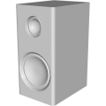
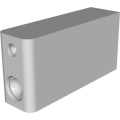
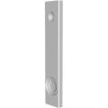
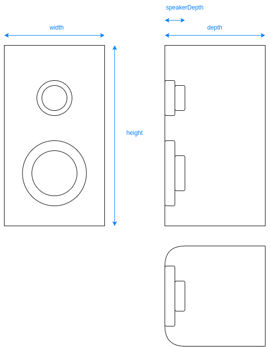

# 3D Assets


## Speaker

This generator creates a 3D speaker. A set
of parameters control the size and the shape of the speaker.
It is possible to generale low-poly speaker by reducing its
complexity, removing edges and using flat shading. Click
on a snapshot to open it online.

<p class="gallery">

	<a class="style-block nocaption" href="../online/speaker?width=15&height=30&depth=20&speakerDepth=2&speakerDetail=12&bevelDetail=2&flat=false&simple=false">
		
	</a>

	<a class="style-block nocaption" href="../online/speaker?width=5&height=5&depth=17.16&speakerDepth=1&speakerDetail=12&bevelDetail=2&flat=false&simple=false">
		
	</a>

	<a class="style-block nocaption" href="../online/speaker?width=20&height=100&depth=5&speakerDepth=2&speakerDetail=12&bevelDetail=2&flat=false&simple=false">
		
	</a>

</p>


### Code example

```js
import { Speaker } from "3d-assets/speaker.js";

var model = new Speaker ({
	width:          15,
	height:         30,
	depth:          20,
	speakerDepth:    2,
	speakerDetail:  12,
	bevelDetail:     2,

	flat:	 false,
	simple:  false,
});
```

### Parameters

#### Legs parameters

* `width` &ndash; width of the speaker box, in cm, [5, 20]
* `height` &ndash; height of the speaker box, in cm, [5, 100]
* `depth` &ndash; depth of the speaker box, in cm, [5, 40  ]
* `speakerDepth` &ndash; depth of the speaker membranes, in cm, [1, 5]

#### Complexity parameters 

* `speakerDetail` &ndash; detail of the speaker membranes, [6, 20]
* `bevelDetail` &ndash; detail of the bevels on the box, [1, 10]
* `simple` &ndash; if *true* the complexity of the profile is reduced, boolean
* `flat` &ndash; if *true* flat shading is used, boolean
	
### Internal structure

An instance of `Speaker` is a `THREE.Group` with one submesh called `body`. 



### Minimal example

[demos/minimal-speaker.html](../demos/minimal-speaker.html)


### Online generator

[online/speaker.html](../online/speaker.html)


### Source

[src/speaker.js](https://github.com/boytchev/assets/blob/main/src/speaker.js)

		
<div class="footnote">
	<a href="../">Home</a>
</div>
