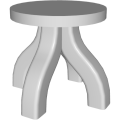
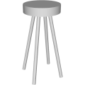

# 3D Assets


## Stool

This generator creates a 3D stool. A set
of parameters control the size and the shape of the stool.
It is possible to generale low-poly stool by reducing its
complexity, removing edges and using flat shading. Click
on a snapshot to open it online.

<p class="gallery">

	<a class="style-block nocaption" href="../online/stool?legWidth=10&legThickness=10&legRoundness=0.04&legCount=4&legOffset=10&legSpread=50&legAngle=0&legShape=0.6&seatSize=50&seatHeight=100&seatThickness=10&legDetail=10&seatDetail=30&legRoundDetail=3&flat=false&simple=false">
		
	</a>

	<a class="style-block nocaption" href="../online/stool?legWidth=2&legThickness=2&legRoundness=0.016&legCount=4&legOffset=10&legSpread=28.8&legAngle=0&legShape=0&seatSize=23.5&seatHeight=100&seatThickness=10&legDetail=5&seatDetail=30&legRoundDetail=3&flat=false&simple=false">
		
	</a>

	<a class="style-block nocaption" href="../online/stool?legWidth=7.9&legThickness=7.4&legRoundness=0.018&legCount=6&legOffset=63&legSpread=66&legAngle=0&legShape=0.07&seatSize=74.8&seatHeight=51.4&seatThickness=30.5&legDetail=5&seatDetail=40&legRoundDetail=3&flat=false&simple=false">
		
	</a>

</p>


### Code example

```js
import { Stool } from "3d-assets/stool.js";

var model = new Stool ({
	legWidth: 10,
	legThickness: 10,
	legRoundness: 0.04,
	legCount: 4,
	legOffset: 10,
	legSpread: 50,
	legAngle: 0,
	legShape: 0.6,
	seatSize: 50,
	seatHeight: 100,
	seatThickness: 10,
	legDetail: 10,
	seatDetail: 30,
	legRoundDetail: 3,
	flat: false,
	simple: false,
});
```

### Parameters

#### Legs parameters

* `legWidth` &ndash; width of the legs in cm, [2, 30]
* `legThickness` &ndash; thickness of the legs in cm, [2, 30]
* `legRoundness` &ndash; size of the bevel on the legs in cm, [0, .1]
* `legCount` &ndash; number of legs on the stool, [3, 6]
* `legOffset` &ndash; offset of the start of the legs from the center of the stool in cm, [0, 100]
* `legSpread` &ndash; offset of the ends of the legs from the center of the stool in cm, [0, 100]
* `legAngle` &ndash; angle at which the legs are connected to the stool in degrees, [0, 150]
* `legShape` &ndash; controlls the harshness of the leg curve, [0, 1]

#### Seat parameters

* `seatSize` &ndash; radius of the seat in cm, [10, 100]
* `seatHeight` &ndash; height at which the seating plane will be in cm, [10, 100]
* `seatThickness` &ndash; thickness of the seat cylinder in cm, [10, 100]

#### Complexity parameters

* `legDetail` &ndash; number of segments along the leg curve, [5, 30]
* `legRoundDetail` &ndash; number of edges across the bevel on the legs, [1, 10]
* `seatDetail` &ndash; number of segments around the seat, [3, 50]
* `simple` &ndash; if *true* the complexity of the profile is reduced, boolean
* `flat` &ndash; if *true* flat shading is used, boolean
	
### Internal structure

An instance of `Stool` is a `THREE.Group` with one submesh called `seat` and `legCount` submeshes called `leg_<i>`. 


### Minimal example

[demos/minimal-stool.html](../demos/minimal-stool.html)


### Online generator

[online/plate.html](../online/stool.html)


### Source

[src/stool.js](https://github.com/boytchev/assets/blob/main/src/stool.js)

		
<div class="footnote">
	<a href="../">Home</a>
</div>
