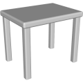
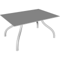
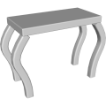
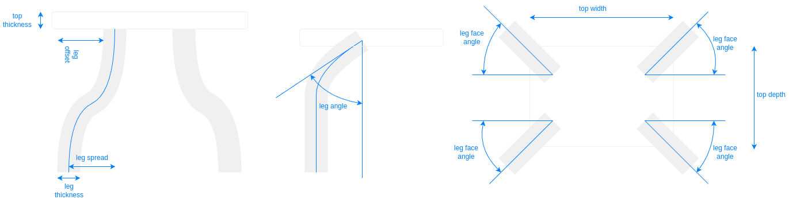

# 3D Assets


## Table

This generator creates a 3D table. A set
of parameters control the size and the shape of the table.
It is possible to generale low-poly table by reducing its
complexity, removing edges and using flat shading. Click
on a snapshot to open it online.

<p class="gallery">

	<a class="style-block nocaption" href="../online/table?legThickness=10&legRoundness=0.02&legOffset=0&legSpread=0&legAngle=0&legFaceAngle=0&legShape=0.6&topWidth=120&topDepth=90&topHeight=100&topThickness=10&topRoundness=0.05&legDetail=10&legRoundDetail=3&topRoundDetail=3&flat=false&simple=false">
		
	</a>

	<a class="style-block nocaption" href="../online/table?legThickness=4&legRoundness=0.011&legOffset=27&legSpread=34&legAngle=0&legFaceAngle=45&legShape=0.6&topWidth=110&topDepth=80&topHeight=55&topThickness=1&topRoundness=0.02&legDetail=18&legRoundDetail=2&topRoundDetail=1&flat=false&simple=false">
		
	</a>

	<a class="style-block nocaption" href="../online/table?legThickness=10&legRoundness=0.02&legOffset=0&legSpread=0&legAngle=34.7&legFaceAngle=0&legShape=0.6&topWidth=120&topDepth=60&topHeight=100&topThickness=10&topRoundness=0.02&legDetail=10&legRoundDetail=3&topRoundDetail=1&flat=false&simple=false">
		
	</a>

</p>


### Code example

```js
import { Table } from "3d-assets/table.js";

var model = new Table ({
	legThickness: 10,
	legRoundness: 0.02,
	legOffset: 0,
	legSpread: 0,
	legAngle: 0,
	legFaceAngle: 0,
	legShape: .6,
	topWidth: 120,
	topDepth: 90,
	topHeight: 100,
	topThickness: 10,
	topRoundness: 0.05,

	legDetail: 10,
	legRoundDetail: 3,
	topRoundDetail: 3,

	flat: false,
	simple: false,
});
```

### Parameters

#### Legs parameters

* `legThickness` &ndash; thickness of the legs, [2, 15],
* `legRoundness` &ndash; size of the round bevel on the legs, [0, .1],
* `legOffset` &ndash; offset of the legs from the end of the table, [0, 100],
* `legSpread` &ndash; distance of the bottom position of the leg to the top, [0, 100],
* `legAngle` &ndash; angle at which the leg contacst the top of the table, [0, 90],
* `legFaceAngle` &ndash; rotation of the legs, [0, 360],
* `legShape` &ndash; modifies the 'sharpness' of the curve, [0, 1],

#### Top parameters 
* `topWidth` &ndash; width of the table, [20, 200],
* `topDepth` &ndash; depth of the table, [20, 200],
* `topHeight` &ndash; height of the table, [10, 130],
* `topThickness` &ndash; thickness of the table top, [1, 10],
* `topRoundness` &ndash; size of the bevel of the top, [0, 0.2],

#### Complexity parameters 

* `legDetail` &ndash; sections along the legs' length, [1, 30],
* `legRoundDetail` &ndash; sections on the leg bevel, [1, 10],
* `topRoundDetail` &ndash; sections on the top bevel, [1, 10],
* `simple` &ndash; if *true* the complexity of the profile is reduced, boolean
* `flat` &ndash; if *true* flat shading is used, boolean
	
### Internal structure

An instance of `Table` is a `THREE.Group` with one submesh called `top` and 4 submeshes called `leg_<i>`. 




### Minimal example

[demos/minimal-table.html](../demos/minimal-table.html)


### Online generator

[online/table.html](../online/table.html)


### Source

[src/table.js](https://github.com/boytchev/assets/blob/main/src/table.js)

		
<div class="footnote">
	<a href="../">Home</a>
</div>
