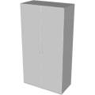
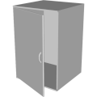

# 3D Assets


## Wardrobe

This generator creates a 3D wardrobe. A set
of parameters control the size and the shape of the wardrobe.
It is possible to generale low-poly wardrobe by reducing its
complexity, removing edges and using flat shading. Click
on a snapshot to open it online.

<p class="gallery">

	<a class="style-block nocaption" href="../online/wardrobe.html?wings=2&wingWidth=40&height=150&thickness=1.5&depth=40&doorRoundness=0.005&doorAngle=0&handleThickness=0.5&handleSize=10&handleRoundDetail=1&doorRoundDetail=1&flat=false&simple=false">
		
	</a>

	<a class="style-block nocaption" href="../online/wardrobe.html?wings=4&wingWidth=40&height=150&thickness=1.5&depth=40&doorRoundness=0.005&doorAngle=0&handleThickness=0.5&handleSize=10&handleRoundDetail=1&doorRoundDetail=1&flat=false&simple=false">
		
	</a>

	<a class="style-block nocaption" href="../online/wardrobe.html?wings=1&wingWidth=40&height=60&thickness=1&depth=40&doorRoundness=0.024&doorAngle=20&handleThickness=1&handleSize=7.1&handleRoundDetail=2&doorRoundDetail=2&flat=false&simple=false">
		
	</a>

</p>


### Code example

```js
import { Wardrobe } from "3d-assets/wardrobe.js";

var model = new Wardrobe ({
	wings: 2,
	wingWidth: 40,
	height: 150,
	thickness: 1.5,
	depth: 40,
	doorRoundness: .005,
	doorAngle: 0,
	handleThickness: 0.5,
	handleSize: 10,
	handleRoundDetail: 1,
	doorRoundDetail: 1,
	flat: false,
	simple: false,
});
```

### Parameters

#### General parameters

* `wings` &ndash; number of wings (sections) of the wardrobe, [1, 4]
* `wingWidth` &ndash; width of each wing in cm, [20, 80]
* `height` &ndash; height of the wardrobe in cm, [60, 210]
* `thickness` &ndash; thickness of the wardrobe sides, back and doors in cm, [.2, 4]
* `depth` &ndash; depth of the wardrobe in cm, [20,  80]

#### Doors parameters

* `doorRoundness` &ndash; size of the bevels in percent, [0, .05]
* `doorAngle` &ndash; rotation of the doors in degrees, [0, 90]

#### Handles parameters

* `handleThickness` &ndash; thickness of the handles in cm, [.1, 1]
* `handleSize` &ndash; size of the handles in cm, [5, 15]

#### Complexity parameters

* `handleRoundDetail` &ndash; detail of the handle profile, [1, 3]
* `doorRoundDetail` &ndash; detail of the door bevel, [1, 4]
* `simple` &ndash; if *true* the complexity of the profile is reduced, boolean
* `flat` &ndash; if *true* flat shading is used, boolean
	
### Internal structure

An instance of `Wardrobe` is a `THREE.Group` with one submesh called `body` and `wings` subgroups called `Door_<i>`. 
Each subgroup contains two submeshes called `door_<i>` and `handle_<i>`.

### Minimal example

[demos/minimal-wardrobe.html](../demos/minimal-wardrobe.html)


### Online generator

[online/wardrobe.html](../online/wardrobe.html)


### Source

[src/wardrobe.js](https://github.com/boytchev/assets/blob/main/src/wardrobe.js)

		
<div class="footnote">
	<a href="../">Home</a>
</div>
