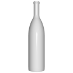
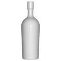
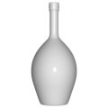
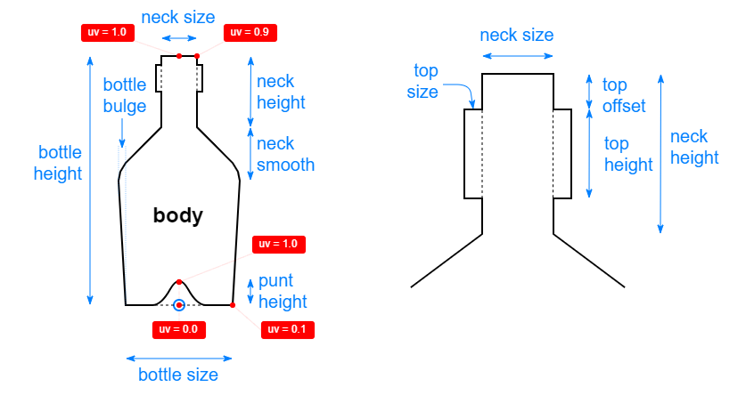

# 3D Assets


## Wine bottle


This generator creates a wine bottle. A set of parameters
control the size and the shape of the bottle. The common
bottle shales (like alsace, bordeaux, champagne or burgundy)
and other shapes can be recreated. It is possible to generale
low-poly mug by reducing the complexity, removing edges and
using flat shading. Click on a snapshot to open it online.

<p class="gallery">

	<a class="style-block nocaption" href="../online/wine-bottle.html?bottleHeight=25&bottleSize=6&bottleBulge=0&bottleComplexity=50&puntHeight=1&neckHeight=5.5&neckSize=2&neckSmooth=3.5&topHeight=0.4&topSize=0.2&topOffset=0.2&opened=true&simple=false&flat=false">
		
	</a>

	<a class="style-block nocaption" href="../online/wine-bottle.html?bottleHeight=20.8&bottleSize=6&bottleBulge=14&bottleComplexity=50&puntHeight=1&neckHeight=5.5&neckSize=2&neckSmooth=1.81&topHeight=2.7&topSize=0.18&topOffset=0&opened=true&simple=false&flat=false">
		
	</a>

	<a class="style-block nocaption" href="../online/wine-bottle.html?bottleHeight=20.8&bottleSize=5.8&bottleBulge=100&bottleComplexity=50&puntHeight=1&neckHeight=7.07&neckSize=1.84&neckSmooth=5&topHeight=1.57&topSize=0.15&topOffset=0&opened=true&simple=false&flat=false">
		
	</a>

</p>


### Code example


```js
import { WineBottle } from "3d-assets/wine-bottle.js";

var model = new WineBottle ({
	bottleHeight: 25,
	bottleSize: 6,
	bottleBulge: 0,
	bottleComplexity: 50,
	puntHeight: 1,
	neckHeight: 5.5,
	neckSize: 2,
	neckSmooth: 3.5,
	topHeight: 0.4,
	topSize: 0.2,
	topOffset: 0.2,
	opened: true,
	simple: false,
	flat: false
});
```


### Parameters

#### Bottle parameters

* `bottleHeight` &ndash; height of the bottle, in cm, [15, 35]
* `bottleSize` &ndash; diameter of the bottom of the bottle, in cm, [5, 15]
* `bottleBulge` &ndash; additional bulge of the bottle midsection, percentage, [0, 10]
* `puntHeight` &ndash; height of punt at the bottle bottom, in cm, [0, 3]
	
#### Neck parameters

* `neckHeight` &ndash; desired height of the neck, in cm, [2, 15]
* `neckSize` &ndash; diameter of the neck, in cm, [1, 3]
* `neckSmooth` &ndash; curvature of the neck, in cm, [0.5, 15]
	
#### Top parameters

* `topHeight` &ndash; desired height of the top, in cm, [0.3, 3]
* `topSize` &ndash; size of the top in addition to the neck, in cm, [0, 0.5]
* `topOffset` &ndash; distance from the top of the bottle, in cm, [0, 1]

#### Complexity parameters

* `bottleComplexity` &ndash; number of faces along the bottle perimeter, [8, 120]
* `opened` &ndash; if *true* the bottle is open and the interior wall is generated, boolean
* `simple` &ndash; if *true* the complexity of the profile is reduced, boolean
* `flat` &ndash; if *true* flat shading is used, boolean
	
	
### Internal structure

An instance of `WineBottle` is a `THREE.Group` with a submeshe
called `body`. 




### Minimal example

[demos/minimal-wine-bottle.html](../demos/minimal-wine-bottle.html)


### Online generator

[online/wine-bottle.html](../online/wine-bottle.html)


### Source

[src/wine-bottle.js](https://github.com/boytchev/assets/blob/main/src/wine-bottle.js)

		
<div class="footnote">
	<a href="../">Home</a>
</div>