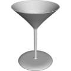

# 3D Assets


## Wine Glass

This generator creates a 3D wine-glass. A set
of parameters control the size and the shape of the wine-glass.
It is possible to generale low-poly wine-glass by reducing its
complexity, removing edges and using flat shading. Click
on a snapshot to open it online.

<p class="gallery">

	<a class="style-block nocaption" href="../online/wine-glass.html?baseSize=2.5&baseThickness=0.3&stemSize=0.2&stemHeight=5&bowlSize=3&bowlHeight=5&bowlShape=0.4&bowlThickness=0.1&rimSize=2.1&roundness=0.02&bevelDetail=6&latheDetail=30&flat=false&simple=false">
		
	</a>

	<a class="style-block nocaption" href="../online/wine-glass.html?baseSize=1.8&baseThickness=0.27&stemSize=0.17&stemHeight=4.8&bowlSize=1.5&bowlHeight=6&bowlShape=0.43&bowlThickness=0.1&rimSize=1.3&roundness=0.013&bevelDetail=6&latheDetail=30&flat=false&simple=false">
		
	</a>

	<a class="style-block nocaption" href="../online/wine-glass.html?baseSize=2.5&baseThickness=0.3&stemSize=0.2&stemHeight=5&bowlSize=1.2&bowlHeight=3&bowlShape=0.4&bowlThickness=0.12&rimSize=3&roundness=0.007&bevelDetail=6&latheDetail=30&flat=false&simple=false">
		
	</a>

</p>


### Code example

```js
import { WineGlass } from "3d-assets/wine-glass.js";

var model = new WineGlass ({
	baseSize: 2.5,
	baseThickness: .3,
	stemSize: .2,
	stemHeight: 5,
	bowlSize: 3,
	bowlHeight: 5,
	bowlShape: .4,
	bowlThickness: .1,
	rimSize: 2.1,
	roundness: .02,
	bevelDetail: 6,
	latheDetail: 30,
	flat: false,
	simple: false,
});
```

### Parameters

#### Base Parameters

* `baseSize` &ndash; radius of the base of the glass in cm, [1, 3]
* `baseThickness` &ndash; thickness of the base of the glass in cm, [.1, .5]

#### Stem Parameters

* `stemSize` &ndash; radius of the stem of the glass in cm, [.1, .4]
* `stemHeight` &ndash; height of the stem of the glass in cm, [2, 10]

#### Bowl Parameters

* `bowlSize` &ndash; radius of the bowl of the glass in cm, [1, 4]
* `bowlHeight` &ndash; depth of the glass in cm, [3, 7]
* `bowlShape` &ndash; shape of the glass in percent, [.1, .9]
* `bowlThickness` &ndash; thickness of the glass walls in cm, [.05, .3]
* `rimSize` &ndash; radius of the rim of the glass in cm, [1, 4]
* `roundness` &ndash; size of the round bevel on the glass, [0, .03]

#### Complexity Parameters

* `bevelDetail` &ndash; number of lateral edges, [1, 10]
* `latheDetail` &ndash; number of edges around the glass, [6, 50]
* `simple` &ndash; if *true* the complexity of the profile is reduced, boolean
* `flat` &ndash; if *true* flat shading is used, boolean
	
### Internal structure

An instance of `WineGlass` is a `THREE.Group` with one submesh called `body`.


### Minimal example

[demos/minimal-wine-glass.html](../demos/minimal-wine-glass.html)


### Online generator

[online/wine-glass.html](../online/wine-glass.html)


### Source

[src/wine-glass.js](https://github.com/boytchev/assets/blob/main/src/wine-glass.js)

		
<div class="footnote">
	<a href="../">Home</a>
</div>
